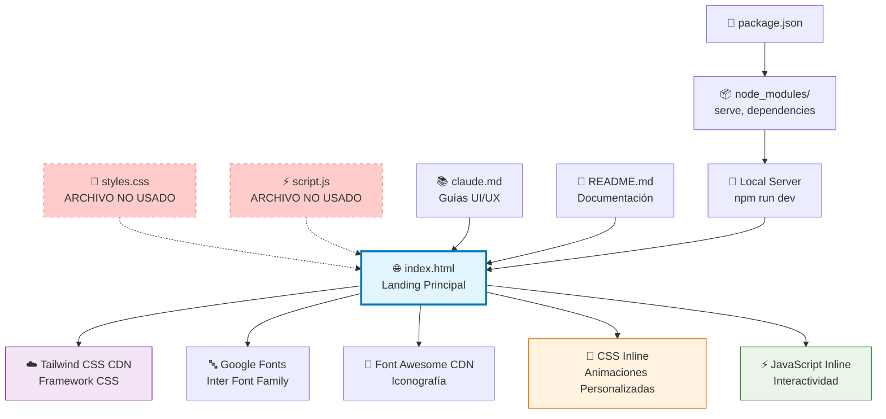
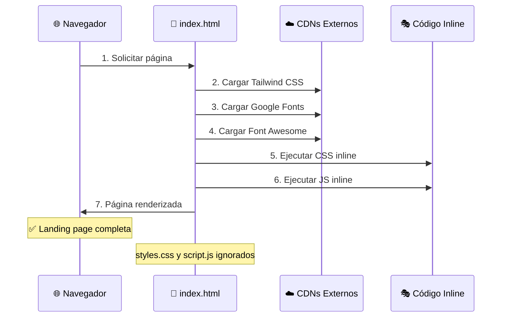

# 🏗️ Arquitectura de Archivos - ChatScan Landing Page

## 📋 Estructura del Proyecto

```
WhatsApp ChillDetector/
├── 📄 index.html          # Landing page principal
├── 🎨 styles.css          # Estilos CSS personalizados (NO USADO)
├── ⚡ script.js           # JavaScript funcional (NO USADO)
├── 📚 claude.md           # Guía operativa UI/UX
├── 📖 README.md           # Documentación del proyecto
├── 🔧 package.json        # Dependencias y scripts
├── 🤖 manifest.json       # Configuración PWA
└── 🗂️ node_modules/       # Dependencias npm
```

## 🔗 Diagrama de Relaciones de Archivos



## 📊 Análisis Detallado de Relaciones

### 🎯 **index.html - Núcleo Central**
El archivo `index.html` es **monolítico** y contiene todo:

#### 📦 **Dependencias Externas:**
```html
<!-- Framework CSS Principal -->
<script src="https://cdn.tailwindcss.com"></script>

<!-- Tipografía -->
<link href="https://fonts.googleapis.com/css2?family=Inter..." rel="stylesheet">

<!-- Iconografía -->
<link rel="stylesheet" href="https://cdnjs.cloudflare.com/ajax/libs/font-awesome/6.4.0/css/all.min.css">
```

#### 🎨 **CSS Integrado:**
```html
<style>
    /* Animaciones personalizadas */
    @keyframes float { ... }
    @keyframes pulse-soft { ... }
    @keyframes heartbeat { ... }
    /* Clases custom */
    .animate-heartbeat { ... }
    .shadow-glow { ... }
</style>
```

#### ⚡ **JavaScript Integrado:**
```html
<script>
    // Configuración Tailwind
    tailwind.config = { ... }
    
    // Funciones interactivas
    function scrollToAnalyzer() { ... }
    function showQRScanner() { ... }
    
    // Event listeners
    document.getElementById('mobile-menu-btn').addEventListener(...)
</script>
```

### 🚫 **Archivos NO Utilizados**

#### ❌ `styles.css` (15,485 bytes)
- **Estado**: Presente pero NO referenciado en HTML
- **Contenido**: Estilos CSS que no se cargan
- **Razón**: Se usa Tailwind CSS + CSS inline en su lugar

#### ❌ `script.js` (21,623 bytes)  
- **Estado**: Presente pero NO referenciado en HTML
- **Contenido**: JavaScript que no se ejecuta
- **Razón**: Se usa JavaScript inline en HTML

### 📋 **Arquitectura Actual vs Esperada**

| **Archivo** | **Esperado** | **Realidad** | **Estado** |
|-------------|--------------|--------------|------------|
| `index.html` | Estructura HTML | ✅ HTML + CSS + JS | Monolítico |
| `styles.css` | Estilos CSS | ❌ No usado | Residual |
| `script.js` | Lógica JS | ❌ No usado | Residual |

## 🔄 **Flujo de Carga de la Página**



## 🎯 **Ventajas de la Arquitectura Actual**

### ✅ **Pros:**
- **🚀 Carga rápida**: Un solo archivo HTML
- **📦 Sin dependencias locales**: Todo vía CDN
- **🔧 Mantenimiento simple**: Todo en un lugar
- **🌐 Portable**: Funciona sin servidor web

### ⚠️ **Contras:**
- **📂 Archivos residuales**: `styles.css` y `script.js` no usados
- **🧩 Monolítico**: Difícil separar responsabilidades
- **☁️ Dependencia CDN**: Requiere internet para estilos
- **📏 Archivo grande**: 58KB de HTML

## 🛠️ **Recomendaciones de Optimización**

### 🔥 **Opción 1: Mantener Monolítico (Actual)**
```bash
# Limpiar archivos no usados
rm styles.css script.js

# Pros: Simplicidad máxima
# Contras: Archivo grande, difícil mantenimiento
```

### 🎯 **Opción 2: Arquitectura Separada**
```html
<!-- En index.html -->
<link rel="stylesheet" href="styles.css">
<script src="script.js"></script>

<!-- Mover CSS inline → styles.css -->
<!-- Mover JS inline → script.js -->
```

### ⚡ **Opción 3: Build System**
```json
// package.json
{
  "scripts": {
    "build": "tailwind build styles.css -o dist/styles.min.css",
    "minify": "terser script.js -o dist/script.min.js"
  }
}
```

## 📈 **Métricas de Performance**

| **Métrica** | **Valor Actual** | **Objetivo** |
|-------------|------------------|--------------|
| **HTML Size** | 58KB | < 50KB |
| **CSS External** | ~40KB (Tailwind CDN) | ~20KB |
| **JS External** | 0KB | 0KB |
| **HTTP Requests** | 4 (CDNs) | < 5 |
| **Load Time** | ~2-3s | < 2s |

---

## 🔍 **Conclusión**

El proyecto ChatScan utiliza una **arquitectura monolítica en index.html** que incluye todo el código necesario, mientras que los archivos `styles.css` y `script.js` **NO están siendo utilizados** y pueden considerarse residuales de una estructura anterior.

Esta arquitectura es **funcional para un landing page**, pero podría beneficiarse de una limpieza de archivos no utilizados para mayor claridad del proyecto.